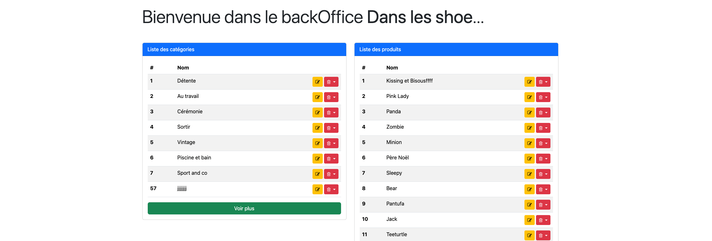
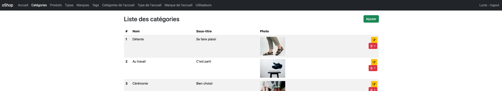

# Oshop BO

Oshop BO est le Back Office du site de vente de chaussures super tendance.
Le projet est fait en MVC.

Il s'agit d'un projet fait durant la formation Développeur Web et Web Mobile.

# Stacks utilisées  

PHP, MYSQL, CSS avec Bootsrap et HTML.

## Installation

1. Installer les dépendances avec `composer install`.
2. Importer la base de données `docs/SQL/database.sql`.
3. Créer le fichier `app/config.ini` à partir du fichier `app/config.ini.dist` et le compléter avec les informations de connexion à la base de données.

